# SSTP data path

How a single user IP packet moves from a Windows VPN client through
the daemon to the kernel forwarding plane, and the role each of
`/dev/ppp`, `/dev/net/tun`, and `/dev/sstp` plays. Audience: backend
or kernel engineers picking up the codebase and wanting to know
*where the cycles go*.

For operator-facing documentation (install, run, configure, RADIUS
interface, control socket), see [admin-guide.md](admin-guide.md).

This document is descriptive, not normative. The wire format is
[MS-SSTP]; the state machines live in [src/sstp/state.rs](../src/sstp/state.rs)
and [src/ppp/driver.rs](../src/ppp/driver.rs); the device-node
plumbing lives in [src/kppp/](../src/kppp/). When this document and
the code disagree, the code is correct — please send a patch.

## TL;DR

The daemon supports two data-path backends, selected per session
via `--data-path {auto,kernel,tun}`:

| Backend     | TLS terminates    | PPP framing  | Per-packet userspace? | Module       |
|-------------|-------------------|--------------|-----------------------|--------------|
| `kernel`    | kernel (kTLS)     | `pppN`       | Control only          | `sstp.ko`    |
| `tun`       | userspace         | userspace    | Yes                   | none (mainline `tun`) |

`auto` picks `kernel` if the kmod is loaded and kTLS is negotiable,
otherwise `tun`. See [Why two backends?](#why-two-backends) for the
design rationale.

## The three device nodes

### `/dev/sstp` — our kernel module ([kmod/](../kmod/))

A single misc char device exported by `sstp.ko`. Per-session state
lives behind the *session fd* returned by `ioctl(SSTP_IOC_ATTACH)`;
the device node itself is stateless.

What attach hands the kernel
([`struct sstp_attach`](../kernel-abi/sstp.h)):

- A TCP socket fd with **kTLS RX+TX already installed** via
  `setsockopt(SOL_TLS, ...)`. The kmod refuses anything else with
  `EOPNOTSUPP` — pulling a userspace TLS stack into the kernel is
  out of scope ([kernel-abi/sstp.h](../kernel-abi/sstp.h) §"Model").
- The negotiated MTU.
- Returns a per-session anon-inode `session_fd` for events +
  control I/O.

The attach struct does **not** carry the PPP unit number. The
channel→unit binding is done separately from userspace via the
`ppp_generic` ABI after attach returns; see [Bring-up
sequence](#kernel-backendppp) below.

What the kmod does:

1. `ppp_register_channel()` — registers a `struct ppp_channel`
   whose `start_xmit` performs SSTP encapsulation (4-byte header,
   [MS-SSTP] §2.2.3) and `kernel_sendmsg`s on the kTLS socket.
2. Hooks `sk_data_ready` on the TCP socket. Inbound bytes are
   pulled via `kernel_recvmsg` on a workqueue, AEAD-decrypted by
   the kernel TLS layer, framed against [MS-SSTP] §2.2.3 (handles
   frames straddling TLS records up to the 4095-byte cap), and
   pushed straight into `ppp_input()` for data frames.
3. Backpressures TX via `sk_write_space` →
   `ppp_output_wakeup()`. Control frames (`C=1`) are queued and
   surfaced to userspace via the session fd
   (`SSTP_EVT_CONTROL_PACKET` + `SSTP_IOC_RECV_CONTROL`).
4. TLS 1.3 `KeyUpdate` and `NewSessionTicket` records are detected
   from the `TLS_GET_RECORD_TYPE` cmsg and surfaced as
   `SSTP_EVT_TLS_REKEY_NEEDED`. Userspace tears the session down
   in response — cooperative rekey across the kmod boundary is
   not implemented (matches HAProxy's AWS-LC + kTLS posture; see
   "Outstanding work for 1.0" item 1).

Closing the session fd detaches the channel. The TCP fd reference
the kernel holds is independent — userspace may close its dup
freely after attach.

The Rust wrapper is [src/kppp/sstp_kmod.rs](../src/kppp/sstp_kmod.rs);
the C side lives in [kmod/](../kmod/) with the frozen UAPI at
[kernel-abi/sstp.h](../kernel-abi/sstp.h) (ABI v0.3, frozen for
the v0.x series).

### `/dev/ppp` — mainline `ppp_generic`

The standard Linux PPP multiplexor. Two fd flavours are relevant:

- **Unit fd** — owns a `pppN` netdev. Created via
  `ioctl(PPPIOCNEWUNIT)`; closing the fd removes the netdev.
  Wrapped by [src/kppp/unit.rs](../src/kppp/unit.rs).
- **Channel fd** — owns a transport (PPPoE, PPPoL2TP, PPTP, async
  serial, or — once attached — our `sstp` channel). Mainline
  Linux has **no generic userspace-channel API**: channels are
  registered only by in-kernel transport drivers. This is the
  single fact that drives our entire data-plane design.

The channel-to-unit binding is done from userspace with the
standard `ppp_generic` ABI:

```text
fd = open("/dev/ppp", O_RDWR | O_CLOEXEC);   // fresh "channel" fd
ioctl(fd, PPPIOCATTCHAN, &chan_index);       // chan_index from SSTP_IOC_GET_CHAN_INDEX
ioctl(fd, PPPIOCCONNECT, &ppp_unit);         // ppp_unit from PPPIOCNEWUNIT
```

We do this from userspace rather than the kmod because
`ppp_connect_channel()` is unexported in mainline `ppp_generic`
and routing the bind through `vfs_ioctl()` from kernel context
buys nothing.

What we do **not** do: read/write IP packets through the unit fd.
On mainline Linux a unit fd with no channel attached behaves as
follows:

- `write()` is treated by `ppp_xmit_process` as the **TX
  direction** — the kernel tries to dispatch the frame to the
  attached channel and silently drops it if none is bound.
  `tx_bytes` ticks up but no IP packet is delivered anywhere.
- `read()` returns EOF. There is no TX queue for userspace to
  drain.

Earlier versions of this codebase claimed the unit fd was a
bidirectional pipe (the `pppd`-over-pty model). That claim was
wrong on mainline kernels: without a channel attached the unit fd
is TX-only and silently drops. The kernel backend therefore relies
on the sstp kmod registering a real `ppp_channel`; there is no
"userspace PPP copier" fallback that would carry traffic through
the unit fd alone.

### `/dev/net/tun` — mainline `tun`

Plain TUN device, opened with `IFF_TUN | IFF_NO_PI`. A real
bidirectional IP pipe:

- `write()` injects an IP packet as **ingress on the netdev**
  (the host stack receives it as if the peer sent it).
- `read()` returns IP packets the host stack wants to **egress**
  through the netdev (i.e. routed *toward* the SSTP peer).

No PPP framing. Wrapped by [src/kppp/tun.rs](../src/kppp/tun.rs).
Used by the `tun` backend; selected automatically by `auto` when
the sstp kmod is unavailable.

## Per-packet flow

### Kernel backend (the fast path)

```mermaid
flowchart LR
  Client[Windows / sstpc] -- TLS over TCP/443 --> NIC[NIC]
  NIC --> kTLS[kernel TLS<br/>AEAD decrypt]
  kTLS --> sstp_ko[sstp.ko<br/>SSTP §2.2.3 demux]
  sstp_ko -- C=0 IP frame --> ppp_input[ppp_input]
  ppp_input --> pppN[pppN netdev]
  pppN --> Forward[Linux IP forwarding]
  sstp_ko -. C=1 control .-> evfd[session fd<br/>POLLIN]
  evfd -. read --> daemon[sstp-server]
```

Steady-state cost per data packet: one kTLS decrypt, one SSTP
header parse, one `ppp_input()`. **Zero** userspace context
switches for IP traffic. Userspace only wakes up for control
frames (Echo-Request, Call-Disconnect, etc.) and to tear down on
TLS 1.3 `KeyUpdate`.

On Linux hosts with `sstp.ko` loaded and a kTLS-eligible cipher
negotiated (TLS 1.2 / 1.3 + AES-GCM or ChaCha20-Poly1305 — see
[`KtlsEligibility`](../src/crypto/tls.rs) for the exact suite
allow-list), this is the path `--data-path auto` selects and the
path traffic flows over. Verified end-to-end by
[`tests/e2e.rs`](../tests/e2e.rs) `sstpc_pap_login`.

### TUN backend (the kmod-free fallback)

```mermaid
flowchart LR
  Client[Windows / sstpc] -- TLS over TCP/443 --> NIC[NIC]
  NIC --> sock[TCP socket]
  sock --> aws_lc[aws-lc<br/>TLS decrypt]
  aws_lc --> demux[sstp::frame<br/>parser]
  demux -- Data --> decode[ppp::frame::decode<br/>strip 0x00ff/0x0021]
  decode --> tunw[write tun fd]
  tunw --> tun0[tun0 netdev]
  tun0 --> Forward[Linux IP forwarding]
  Forward -. egress .-> tun0r[tun0]
  tun0r --> tunr[read tun fd]
  tunr --> encode[ppp::frame::encode<br/>prepend 0x00ff/0x0021]
  encode --> wrap[write_ppp_as_sstp_data]
  wrap --> aws_lc2[aws-lc encrypt]
  aws_lc2 --> sock
```



Steady-state cost per data packet:

- **RX (peer → host):** kernel→userspace copy + AEAD decrypt +
  SSTP parse + 2-byte PPP header strip + userspace→kernel copy.
- **TX (host → peer):** kernel→userspace copy + 2-byte PPP
  header prepend + 4-byte SSTP header prepend + AEAD encrypt +
  userspace→kernel copy.

Two userspace round-trips per packet; throughput caps in the
1–2 Gbps range per session on commodity hardware. Acceptable as a
fallback / for low-rate sessions, not a target for headline
benchmark numbers.

The session driver lives in [src/session.rs](../src/session.rs)
(`drive_sstp` → `KpppRead` arm + the `Packet::Data` arm).

## Bring-up sequence

[`KpppSession::bring_up`](../src/kppp/session.rs) runs once per
session, after IPCP converges and the in-process PPP FSM hands
the session task an `AssignedAddrs`. There is no
`/dev/sstp`-without-`/dev/ppp` mode and no `/dev/ppp`-without-a-
channel mode that carries traffic.

### Kernel (`Backend::Ppp`)

```text
1. open  /dev/ppp                             # unit fd
2. ioctl PPPIOCNEWUNIT      → ppp_unit, pppN  # netdev created
3. RtNetlink: RTM_NEWADDR (P2P pair)          # local + peer
              RTM_NEWLINK  (IFLA_MTU, IFF_UP) # 1500, up
4. open  /dev/sstp                            # then close after attach
5. ioctl SSTP_IOC_ATTACH    → session_fd      # kTLS+TCP fd in,
                                              # session_fd out
6. ioctl SSTP_IOC_GET_CHAN_INDEX → chan_index
7. open  /dev/ppp                             # second fd, channel role
   ioctl PPPIOCATTCHAN(chan_index)
   ioctl PPPIOCCONNECT(ppp_unit)              # binding established
8. AsyncFd<session_fd>, READABLE              # wait for events
```

After step 7 the kernel owns the per-frame data path. The session
task only wakes up on the session fd (`SSTP_EVT_CONTROL_PACKET`,
`SSTP_EVT_PROTOCOL_ERROR`, `SSTP_EVT_TLS_REKEY_NEEDED`,
`SSTP_EVT_PEER_CLOSED`). The `AsyncFd<session_fd>` itself is
created lazily when the session driver enters its main
`select!` loop, not inside `bring_up`.

Drop order on teardown follows struct field order in
[`PppBackend`](../src/kppp/session.rs): `Unit` drops first
(closes the unit fd → kernel removes `pppN`), then `KmodSession`
(closes session fd → kmod detaches the channel and `fput`s its
held TCP file reference). The two are independent on the kernel
side, so order does not matter functionally; this is the order
that actually runs. A panic in the session task unwinds through
the same Drop chain.

### TUN (`Backend::Tun`)

```text
1. open  /dev/net/tun
2. ioctl TUNSETIFF (IFF_TUN | IFF_NO_PI, name="")  → tunN
3. fcntl O_NONBLOCK
4. RtNetlink: RTM_NEWADDR (P2P pair)
              RTM_NEWLINK  (IFLA_MTU, IFF_UP)
5. AsyncFd<tun_fd>, READABLE | WRITABLE
```

The session driver `select!`s on `tun_fd.readable()` for the
host→peer direction and feeds peer→host packets straight into
`tun_fd.write()` from the SSTP demux arm.

## Frame layouts at the boundary

For the TUN path the userspace code does the framing translations
the kernel module would otherwise hide.

**Inside an SSTP data packet** ([MS-SSTP] §2.2.3 + PPP):

```
+--------+--------+--------+--------+--------+--------+--------+--------+
| 0x10   | C=0    |     length      | 0xFF   | 0x03   |   protocol      |  PPP header
| ver    | R      |  (incl. hdr)    |  Addr  |  Ctl   |   (0x0021=IPv4) |
+--------+--------+--------+--------+--------+--------+--------+--------+
|                                                                       |
~                              IP payload                                ~
|                                                                       |
+-----------------------------------------------------------------------+
```

The `0xFF 0x03` Address/Control prefix is uncompressed — we don't
negotiate Address-and-Control-Field-Compression, partly because
the kmod path expects uncompressed frames and partly to keep the
frame layout stable across LCP renegotiation. The SSTP header is
always 4 bytes (no extensions are defined for data packets).

[`ppp::frame::decode_frame`](../src/ppp/frame.rs) and
[`encode_frame`](../src/ppp/frame.rs) handle the
strip/prepend; the SSTP layer is
[`sstp::frame`](../src/sstp/frame.rs).

## Why two backends?

The short answer: different deployment realities.

- **kernel** is the design target. Headline throughput, zero
  userspace involvement on the data path, ABI-stable handoff
  through `/dev/sstp`. Requires the kmod to be loaded and the
  kernel to expose kTLS for the negotiated cipher.
- **tun** is the escape hatch. Available on any modern Linux
  (`/dev/net/tun` is universal), no out-of-tree module, no kTLS
  dependency. Per-packet userspace round-trip is the price.

The two-backend split keeps the netlink code (address push, MTU,
link-up) and the per-session lifecycle code (FSM hookup,
accounting sampler, panic Drop) shared — only the per-frame
copier differs. See [`KpppSession`](../src/kppp/session.rs)
`Backend` enum and the `is_kernel()` / `is_tun()` predicates that
gate the read/write paths.

## Status

- **kmod** ([kmod/](../kmod/)) — v0.3, ABI frozen, full
  per-frame data path implemented in C. Builds against any
  reasonably modern Linux kernel tree with `CONFIG_PPP=m` and
  `CONFIG_TLS=m` (verified on 6.8 and 6.12). **Functional and
  tested to pass traffic.**
- **kTLS plumbing** ([src/crypto/tls.rs](../src/crypto/tls.rs),
  [src/crypto/ktls.rs](../src/crypto/ktls.rs)) — landed.
  `TlsStream::install_ktls()` extracts the post-handshake
  traffic keys + sequence numbers from `aws-lc-sys` and installs
  TX+RX `crypto_info` on the TCP socket via
  `setsockopt(SOL_TLS, ...)`. Dispatched from
  [src/session.rs](../src/session.rs) when the session resolves
  to `DataPathMode::Kernel` and the negotiated cipher is
  kTLS-eligible. Falls back cleanly to TUN if either prerequisite
  is missing.
- **Kernel backend end-to-end** — verified by
  [`tests/e2e.rs`](../tests/e2e.rs) `sstpc_pap_login`. When
  `/dev/sstp` is present the test hard-asserts
  `kmod_attach_succeeded`, `!tun_fallback_taken`,
  `ifname.starts_with("ppp")`, and `server_rx_after >
  server_rx_before` after an ICMP echo — i.e. the kmod is the
  one moving bytes.
- **TUN backend** — landed and verified by the same test in
  environments without `/dev/sstp`: one ICMP echo, server-side
  `tunN` `rx_bytes` strictly grows (the assertion is
  `server_rx_after > server_rx_before`, not a fixed byte count).

## Outstanding work for 1.0

Data-path-scoped items (control-plane / RADIUS / accounting
todos are tracked elsewhere). Each item is grounded in code that
exists today; citations point at the file:line you'd start
from.

1. **TLS 1.3 KeyUpdate / NewSessionTicket: deliberately fatal.**
   The kmod detects post-handshake TLS records and emits
   `SSTP_EVT_TLS_REKEY_NEEDED`
   ([kmod/sstp_demux.c](../kmod/sstp_demux.c) §TLS-record
   classifier). Userspace classifies via the rekey FSM
   ([src/crypto/rekey.rs](../src/crypto/rekey.rs)) and tears the
   session down. **This is the intended v0.x behaviour, not a
   TODO.** It matches HAProxy's AWS-LC + kTLS posture: HAProxy's
   vanilla OpenSSL build supports cooperative rekey through
   `BIO_CTRL_SET_KTLS` (libssl drives the dance internally), but
   the AWS-LC / BoringSSL build classifies any non-
   `application_data` record post-handshake as fatal because
   AWS-LC exposes no equivalent hook. We use AWS-LC for the same
   reasons HAProxy does and inherit the same constraint.
   Server-side `NewSessionTicket` emission is suppressed at
   handshake time (`SSL_CTX_set_num_tickets(0)` +
   `SSL_OP_NO_TICKET`), so a healthy peer's only realistic cause
   for `REKEY_NEEDED` is a TLS 1.3 `KeyUpdate`. Windows / sstpc
   do not send them in practice; `SESSION_TEARDOWN_REKEY_*`
   counters exist to surface exotic peers.
   The `SSTP_IOC_REKEY_TX` / `SSTP_IOC_REKEY_RX` ioctls are
   reserved-but-not-planned (`-ENOSYS`); revisit if long-lived
   tunnels start hitting the AES-GCM per-key record-count
   ceiling (~2^24.5 records).

2. **IPv6 data plane.**
   [`Ppp` driver](../src/ppp/driver.rs) negotiates IPCP only;
   [`session::handle_ppp_data`](../src/session.rs) routes only
   PPP protocol `0x0021` (IPv4) into the TUN write path.
   [`TunSession::encode_frame`](../src/kppp/tun.rs) already
   detects IPv4 vs IPv6 from the version nibble, so the
   primitives exist; what's missing is the IPV6CP FSM and the
   `0x0057` dispatch. The kmod side is already
   protocol-agnostic (it just calls `ppp_input()`), so the
   kernel backend gets IPv6 for free once IPV6CP converges.

3. **Outbound-control wiring (mostly landed).**
   ABI v0.3 froze
   [`SSTP_IOC_SEND_CONTROL`](../kernel-abi/sstp.h) and
   [`drive_sstp`](../src/session.rs) `apply_step` now routes
   every `C=1` SSTP control frame through
   [`KmodSession::send_control`](../src/kppp/sstp_kmod.rs)
   when the kernel backend is attached (kmod prepends the
   4-byte SSTP header on the kernel side).
   Backpressure is `-EAGAIN` with `EPOLLOUT` on the TCP socket;
   hard send errors abort the session, mirroring the data-path
   TX worker. What's left for 1.0 is closing
   [`TxStream::ktls_tx`](../src/session.rs) post-attach and
   hanging the writability wait off the session fd's
   `EPOLLOUT` instead — that retires the last shared writer of
   the TLS socket and lets `SSTP_IOC_REKEY_TX` /
   `SSTP_IOC_REKEY_RX` (currently `-ENOSYS` stubs) become the
   only path to rotate kTLS keys.

4. **`--data-path kernel` strict-mode CI.**
   The auto-mode e2e test
   ([tests/e2e.rs](../tests/e2e.rs) `sstpc_pap_login`) covers
   both backends opportunistically. There is no test that
   pins `--data-path kernel` and asserts the session *fails
   loudly* on a host without `/dev/sstp` or with a non-kTLS
   cipher — i.e. that strict-mode actually refuses to fall back.
   Needed to keep the fallback logic from regressing into
   strict mode by accident.

5. **NP-mode filtering parity.**
   The TUN backend grew a userspace
   [`np_filter_decide`](../src/session.rs) that enforces
   pre-IPCP drop and MRU bounds before any payload reaches the
   `tunN` write path; the kernel backend continues to ride on
   `ppp_generic`'s in-kernel NP filter. The two are not bit-for-
   bit equivalent (the userspace filter has its own MRU enforcement
   and counters; `ppp_generic` exposes `npmode` to operators)
   but the *behavioural* gap is closed. Outstanding: decide
   whether to surface the kmod's NP state through
   `ip -s -d link show pppN` (today's path) or to add a
   shared metric on the userspace side so `show stat` reports
   both backends uniformly.

## See also

- [admin-guide.md](admin-guide.md) — operator-facing setup,
  RADIUS interface, control socket, troubleshooting.
- [MS-SSTP-spec.md](../MS-SSTP-spec.md) — wire format,
  rendered from the Microsoft Open Specification PDF.
- [kernel-abi/sstp.h](../kernel-abi/sstp.h) — UAPI for the
  kmod, including the `Model` and `Cross-references` block.
- [kmod/README.md](../kmod/README.md) — kmod build, load,
  and test harness.
